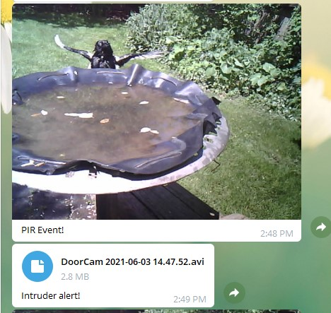
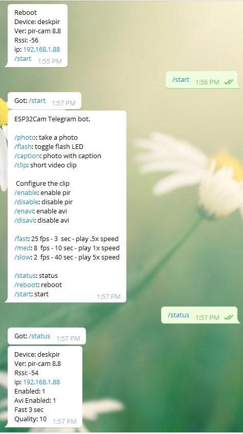

# ESP32-CAM-Video-Telegram
Record avi video on ESP32-CAM and send to Telegram on event or request

Jan 17, 2022  
  
ESP32-CAM-Video-Telegram_8.8x.ino --- Arduino 1.8.13 / esp32-arduino 1.6.0  
ESP32-CAM-Video-Telegram_8.9x.ino --- Arduino 1.8.19 / esp32-arduino 2.0.2    


<h2> Description </h2>

This program runs on a simple ESP32-CAM module without a SD card installed, and will respond to Telegram requests to take a photo or video, and then send it to the Telegram server to arrive at your phone or computer.  If you set up an active-high PIR or radar sesnsor to pull up Pin 13, then it will take a photo and a video of the event that set off the PIR, and then a video afterwards.  The video can be "fast" at 25 frames-per-second, "med" at 8 fps, or "slow" at 2 fps.  The video is recorded in the psram of the ESP32-CAM module, so there is only about 3MB of space available, which means about 60 bright outdoor frames, or 150 dull bland frames.  So the videos will be about 3 seconds, 10 seconds, and 40 seconds long.  As well, it is set to play the fast video at half speed, the medium video at realtime, and the slow video at 5x speed, so your 40 seconds video will play in timelapse over 10 seconds or so.  

You could adjust the quality parameters of the framesize to get more frames for longer videos.  It is currently set up for VGA (640x480) and quality 10 (good, not great), so you could switch to QVGA (320x240) and quality 20 to get many more frames with the 3MB buffer.  The ov2640 camera and drivers also double in speed below CIF (400x296) size.  (I think that still works?)

<h2> Demo </h2>

As seen on Telegram screen: <br>



Click below to see DoorCam....avi as seen on Youtube - the picture here is the first frame of the avi, which is one frame after the jpeg sent to Telegram or about 40ms.  It does not go to Youtube automatically - I just did that as I cannot play a video from github site.  But you can download it below.  Telegram only handles mp4 files inline, so the avi just appears as a file.

[](http://www.youtube.com/watch?v=x4JaLOefIWA "Magpie from Youtube")

The file as served by Telegram:<br>

https://github.com/jameszah/ESP32-CAM-Video-Recorder-samples/blob/master/ESP32-Cam-Telegram/DoorCam%202021-06-03%2014.47.52.avi
  
The file uploaded to Youtube - now converted to Youtube's formats:  
https://youtu.be/x4JaLOefIWA

Click to see the 25 fps in slow motion.<br>

[](http://www.youtube.com/watch?v=KBXaL-kRRFI "Robin from Youtube")

Click to see the 2 fps in 5x timeslapse motion.  This is very dull light, meaning the frames are small and you get over 1 minute at 2 fps played over 15 seconds, and even then it hit the 150 frames limit, rather than the 3MB limit.<br>

[](http://www.youtube.com/watch?v=Y0s_3u5maDU "Dull Timelapse")

<h2> Controls </h2>


If you put in your correct Telegram chat_id, you will get a message when the ESP32-CAM boots, and then the /start command will produce the following.  
You can ask for a photo or a clip (photo plus avi), or reconfigure the ESP32 for different clip lengths, and disable the PIR, or disable the "avi", which means it will just send the photo and skip the avi.

The 3MB clip can take a minute to send to the Telegram server, so you may want to shut if off at times.  I'm not sure how many 3MB avi's Telegram will store for you, or if they get annoyed if you send too many.  They also pile up on my Android phone, so you need to empty your Telegram history from time to time.



It defaults to PIR enabled, and avi enabled amd a "fast" 25fps 3 second video.

<h2> Compile Time Parameters </h2>

```
char ssid[] = "yourssid";         
char password[] = "yourssidpass"; 
String TIMEZONE = "GMT0BST,M3.5.0/01,M10.5.0/02";  
String chat_id = "1234567890";
#define BOTtoken "XXXXXXXXX:XXXXXXXXXXXXXXXXXXXXXXXXXXXXXXXXXXX" 

// see here for information about getting free telegram credentials
// https://github.com/witnessmenow/Universal-Arduino-Telegram-Bot
// https://randomnerdtutorials.com/telegram-esp32-motion-detection-arduino/
// find your timezone here 
// https://sites.google.com/a/usapiens.com/opnode/time-zones  
```

<h2> Hardware </h2>

Hardware looks similar to the photos, samples over here.  
Just remember it is gpio 13 with a big resistor (10 Kohm), active high PIR, and it makes sense to put a big capacitor between power and ground to cover currennt surges from the WiFi.

https://github.com/jameszah/ESP32-CAM-Video-Recorder

---

Jan 24, 2022 - question about bots

In response to an email query:  

A telegram bot is like a person receiving and replying to messages.  The bot is a simple receive/reply system.  When it boots it sends one message to the hard-coded owner of the bot (10 digit number in chat_id), and thereafter it responds to anyone in the telegram universe that sends a message.  Obviously a little esp32 cannot respond to millions of messages, but anyone can send it a message.  This line below grabs the identity of the person sending a message, and uses that identity to send a message back.  You could delete this line, and it would always send messages back your hard-coded identiy.  Or check if the caller is you or one of your friends, and then reply to them, or ignore them.

https://github.com/jameszah/ESP32-CAM-Video-Telegram/blob/87c9ffa764ef58648e143ca038c49ba51b8964bf/ESP32-CAM-Video-Telegram_8.9x.ino#L302


